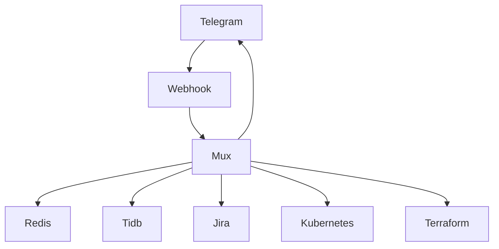

# Manage multi-tenancy kubernetes cluster using telegram bot

## Introduction
How to manipulate and optimize multi-tenancy kubernetes resource is one of the 
big challenge since there are a lot of thing to take a look and SRE teams can't
have enough human resource and competence to handle everything in a while.

## Requirement
To adapt with the fast pace of development lifecycle, we need convenient tools
to troubleshoot and automate a lot of kubernetes clusters

- Maintenance switching without downtime
- Version control 
- Capacity control
- Check healthy status

## System dependencies
### Overview

## Restful APIs
### Bot we

## Services
### Telegram bot

### Mux
### Parser
### Render
